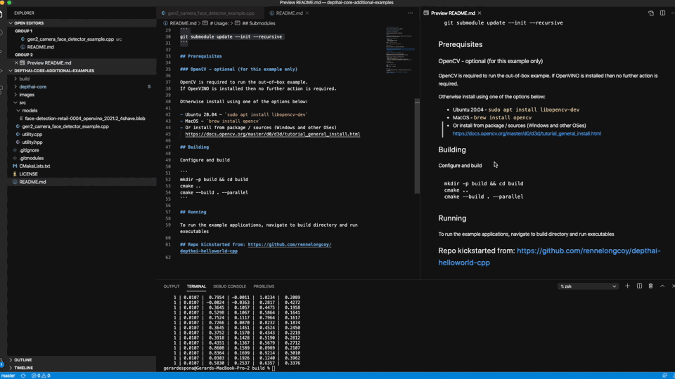

# depthai-core-additional-examples

My own C++ additional examples using DepthAI

If you look for the same examples for python take a look here https://github.com/gespona/depthai-python-additional-examples

If you look for the same examples inside Unity take a look here https://github.com/gespona/depthai-unity-plugin

# gen2_camera_face_detector_example

Face detector from modelplace.ai

Single step pipeline identical to MobileNet




# gen2_movenet_example

Simple implementation of MoveNet Single Pose tracking for depthai

Two variants: Lightning and Thunder

TODO: Implement smart crop on frame n+1 based on detection from frame n

Usage: gen2_movenet_example -i [camera|image path] -m [lightning|thunder]


Credits: 
Models were generated by PINTO and are also available there: https://github.com/PINTO0309/PINTO_model_zoo/tree/main/115_MoveNet

Thanks to the great support of [Pinto](https://github.com/PINTO0309) and [geaxgx](https://github.com/geaxgx)

If you're looking for python implementation take a look here:
https://github.com/geaxgx/openvino_movenet

# Usage:

CMake example project which serves as a template on how to quickly get started with C++ and depthai library

## Depthai library dependencies

- cmake >= 3.2
- libusb1 development package
- C/C++11 compiler

MacOS: `brew install libusb`

Linux: `sudo apt install libusb-1.0-0-dev`

## Submodules

Make sure submodules are initialized and updated

```
git submodule update --init --recursive
```

## Prerequisites

### OpenCV - optional (for this example only)

OpenCV is required to run the out-of-box example.
If OpenVINO is installed then no further action is required.

Otherwise install using one of the options below:

- Ubuntu 20.04 - `sudo apt install libopencv-dev`
- MacOS - `brew install opencv`
- Or install from package / sources (Windows and other OSes)
  https://docs.opencv.org/master/d0/d3d/tutorial_general_install.html

## Building

Configure and build

```
mkdir -p build && cd build
cmake ..
cmake --build . --parallel
```

## Running

To run the example applications, navigate to build directory and run executables

## Repo kickstarted from: https://github.com/rennelongcoy/depthai-helloworld-cpp

If you find this repo interesting please star / watch to stay tunned !
